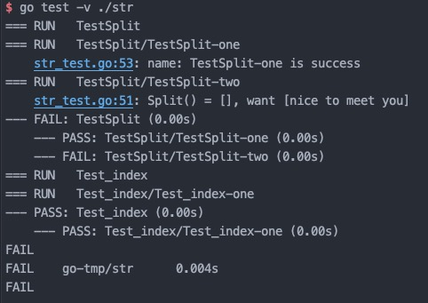
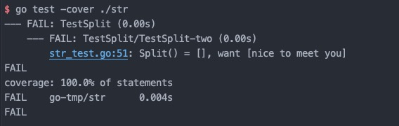
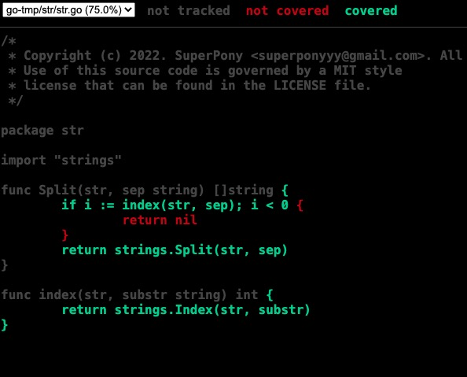

# 测试
- Index
  - 测试
  - 单元测试
    - 单元测试 go test 相关选项
    - *test.T 方法说明
    - 子测试
    - 并行测试
    - 测试覆盖率
  - 性能测试
    - 性能测试 go test 相关选项
    - *test.B 方法说明
    - 统计内存
  - 示例测试
    - 大型示例
    

# 测试
测试分为两种测试：
  - 白盒测试：测试代码与生产代码组织在同一个包中，这使开发人员可以同时测试可导出以及不可导出的代码；
  - 黑盒测试：测试代码与生产代码不组织在同一个包中，故而仅可以测试可以导出的代码。
在白盒测试中，测试代码与生产代码保持在同一个包内，同时，测试代码的文件以 _test.go 结尾，例如： order.go ,则对应单元测试的文件名为 order_test.go。
在黑盒测试中，测试代码与生产代码包名不同，但仍然可以放在一个目录下，例如生产代码的包名为 order, 则对应测试代码的包名为 order_test。
原则上，如无必要理由，优先使用白盒测试，一方面这是 go test 工具的默认行为；另一方面，白盒测试可以同时测试可导出以及不可导出的代码。

测试文件与测试代码的规范，则由 Go 语言以及 gotest 工具来强制约束，单元测试主要分为三种类型，类型如下:

| 类型         | 格式              | 作用            |
|------------|-----------------|---------------|
| 单元测试（T 类型） | 函数名前缀 Test      | 测试函数的逻辑行为是否正常 |
| 性能测试（B 类型） | 函数名前缀 Benchmark | 测试函数性能        |
| 示例函数（E 类型） | 函数名前缀 Example   | 为文档提供示例       |


# 单元测试

测试用例的函数名必须以`TestFuncName`（可导出函数）表示，或 `Test_funcName`（不可导出函数），同时参数必须是 `*testing.T`,该参数用于记录错误或测试状态。



```
=== RUN   TestSplit // 执行的用例
=== RUN   TestSplit/TestSplit-one 由于使用了子测试，故而此处表示 用例名/子用例名
    str_test.go:53: name: TestSplit-one is success // TestSplit-one(子用例名) is success（t.Log 函数输出的内容）
=== RUN   TestSplit/TestSplit-two
    str_test.go:51: Split() = [], want [nice to meet you] // TestSplit-one(子用例名) want [nice to meet you]（t.Errorf 函数输出的内容）
--- FAIL: TestSplit (0.00s) //FAIL 表示失败的用例, PASS 表示成功的用例
    --- PASS: TestSplit/TestSplit-one (0.00s)
    --- FAIL: TestSplit/TestSplit-two (0.00s)
=== RUN   Test_index
=== RUN   Test_index/Test_index-one
--- PASS: Test_index (0.00s)
    --- PASS: Test_index/Test_index-one (0.00s)
FAIL
FAIL    go-tmp/str      0.004s
FAIL
```


# 单元测试 go test 相关选项

命令格式为: `go test [flag] path`,常用选项如下：

- `v`: 默认情况下，仅输出失败的用例，`-v` 表示输出详细信息，其中包括le：测试通过的用例，以及用例执行时间；
- `cover`: 输出覆盖率；
- `coverprofile`:将覆盖率信息输出到指定文件中，例如`go test -cover -coverprofile=./cover.out .`
- `run`: `run`参数的值是一个正则，表示只运行匹配到的测试函数；

## *testing.T 方法说明

| 函数                       | 说明                             |
|--------------------------|--------------------------------|
| t.Log, t.Logf            | 输出信息，用于输出正常信息                  |
| t.Error, t.Errorf        | 输出测试失败的信息，同时标志该测试失败            |
| t.Fatal, t.Fatalf        | 致命错误，退出测试的信息                   |
| t.Fail                   | 标志该测试失败                        |
| t.Failed                 | 查看是否失败                         |
| t.Skip,t.Skipf,t.Skipped | 跳过当前测试，跳过当前测试并输出信息，返回是否跳过了当前测试 |
| t.Parallel               | 将测试函数标志为并行运算                   |

## 子测试
在 Go1.7 以后加入了子测试的概念，用于解决测试中用往往需要多组数据进行测试，从而提高测试效果的场景；

```
func TestXXX(t *testing.T) {
  t.Run("case1", func(t *testing.T){...})
  t.Run("case2", func(t *testing.T){...})
  t.Run("case3", func(t *testing.T){...})
}
```

## 并行测试

默认情况下，测试用例以串行方式执行，可以通过设置 `t.Parallel()` 将函数设置为以并行方式运行；

```
func TestXXX(t *testing.T) {
  t.Parallel()
  ...
}
```

## 测试覆盖率

覆盖率指代码被测试用例覆盖的百分比，通俗地讲，指在实际运行中，至少使用过一次的代码在总代码中的总占比。
Go 语言内置了覆盖率检测的工具，即使用 `go test -cover` 来查看代码覆盖率。
coverage: number%  表示覆盖率。


除此之外，Go test 提供了 `-coverprofile` 参数，用于将覆盖率的信息输出到一个文件中，例如 `go test -cover -coverprofile=./cover.out`;
如果有需要，可以接着执行 `go tool cover -html=./cover.out`，通过使用 cover 工具处理生成的信息，将其输出到浏览器中。

其中，红色代码表示未覆盖到代码，绿色表示覆盖到的代码。



# 性能测试（基准测试）


性能测试的函数名必须以`BenchmarkFuncName`（可导出函数）表示，或 `Benchmark_funcName`（不可导出函数），同时参数必须是 `*testing.B`,该参数用于记录错误或测试状态。

`*testing.B`有一个 `N` 字段，该字段表示性能测试会执行的次数，该字段会根据系统的实际性能进行调整，不需要人为的调整。

```
$ go test -bench="." -benchmem ./str
goos: darwin
goarch: amd64
pkg: go-tmp/str
cpu: Intel(R) Core(TM) i5-8500B CPU @ 3.00GHz // cpu 相关信息
Benchmark_index-6       306990589                3.927 ns/op
PASS
ok      go-tmp/str      1.607s

Benchmark_index-6: 用例名称-参与执行的线程的个数（默认值为 GOMAXPROCS）
306990589: 函数中循环执行的次数
3.927 ns/op: 每次循环的执行平均耗时为 3.927 纳秒，该值越小，性能越高
```


## 性能测试 go test 相关选项

- `bench`: 默认情况下，go test 不会执行性能测试，需要通过声明 `-bench=pattern` 选项，来表示执行性能测试，`-bench` 的值是一个正则，表示要匹配的性能测试函数名, `.`，`。*` 表示匹配所有性能测试函数；
- `benchmem`: 执行性能测试时，输出内存分配统计；
- `benchtime`: 该参数用于设置性能测试的时间或执行的次数，格式为 `-benchtime=10s` 或 `-benchtime=10000x`, 如果指定执行的测试，则次数后以x结尾；
- `cpu`: 指定`GOMAXPROCS`;
- `timout`: 指定测试函数执行的超时时间。

## *testing.B 方法说明

`*testing.B` 的方法于 `*testing.T` 大部分一致，独有的方法如下：

| 方法                        | 说明        |
|---------------------------|-----------|
| b.StopTimer, b.StartTimer | 停止计时、启动计时 |
| b.ResetTimer              | 重置计时      |

## 统计内存

通过 `-benchmem` 选项来设置在输出性能时，输出内存分配的相关情况；

```
$ go test -bench="." -benchmem ./str
goos: darwin
goarch: amd64
pkg: go-tmp/str
cpu: Intel(R) Core(TM) i5-8500B CPU @ 3.00GHz
Benchmark_index-6       306990589                3.927 ns/op           0 B/op          0 allocs/op
PASS
ok      go-tmp/str      1.607s

0 B/op: 每次执行分配了内存（字节），该值越小，说明内存占用越少；
0 allocs/op: 每次执行分配了所少次内存，该值越小，说明内存分配的次数越少，则比意外着性能更高。 
```


# 示例测试

示例测试以`Exapmle`开头，没有输入和返回参数，通常集中组织在 example_test.go 文件中；示例测试中包含了`Output:`开头的注释，这些注释按约定放在函数末尾。在执行测试时，会执行这些测试。并且， go test 会将示例测试输出到标准输出的中，并将其与 `Output:`后面的内容进行对比，如果相等，则测试通过，反之，测试不通过；

同一个函数的示例测试可以有多个，格式为 `func ExampleXXX`,`func ExampleXXX_second`...

```
// example_test.go

func ExampleSplit() {
	fmt.Printf("%q\n", Split("hello world", " "))
	fmt.Printf("%q\n", Split("nice,to,meet,you", ","))
	// Output:
	// ["hello" "world"]
	// ["nice" "to" "meet" "you"]
}

func ExampleSplit_second() {
	fmt.Printf("%q\n", Split("my,name,is,jack", ","))
	// Output:
	// ["my" "name" "is" "jack"]
}
```

## 大型示例测试
有时候可能需要编写一个大型的示例测试，它有如下几个特点：
1. 通常会单组组织在一个以`_test`结尾的包内;
2. 文件中，只包含一个示例测试，没有单元测试和性能测试；
3. 可以有多个文件，文件名为`example_xxx_test.go`, `xxx` 对应需要示例测试的函数名。