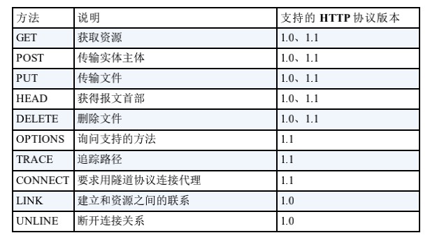
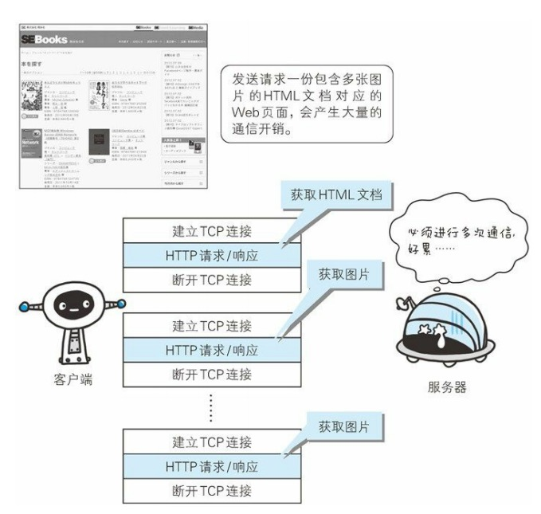
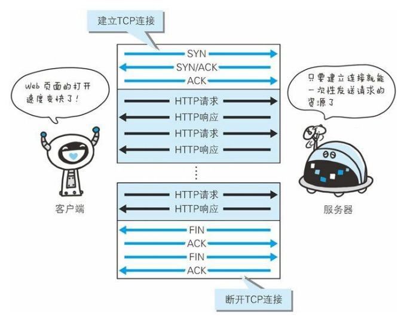
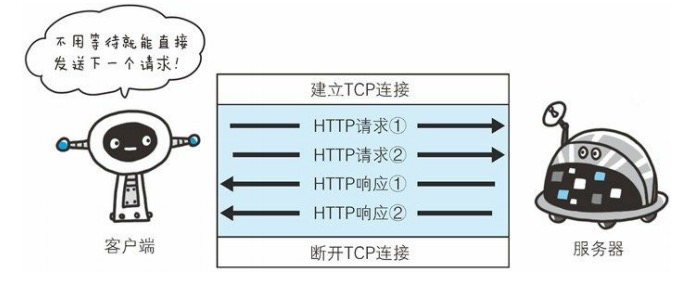
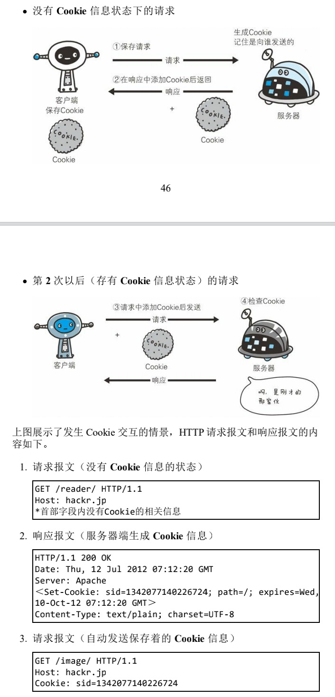
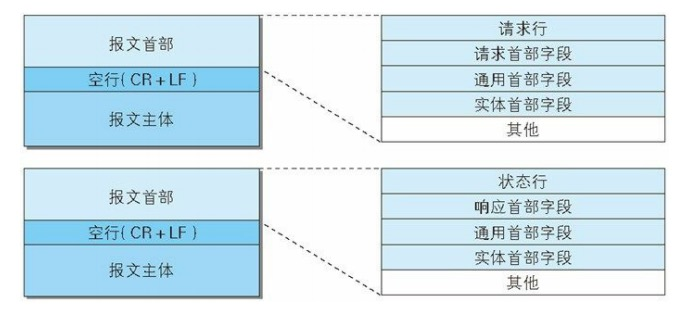
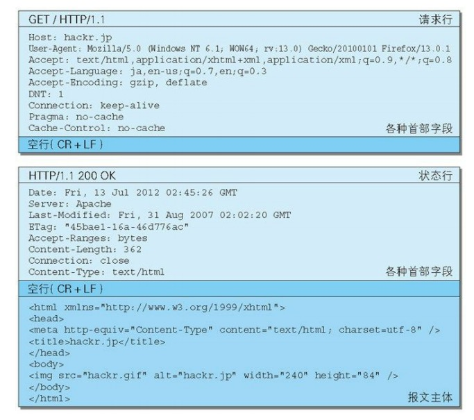
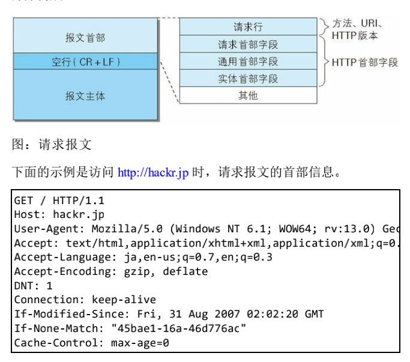
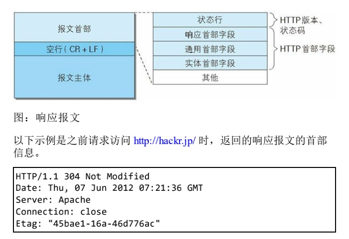

# HTTP 
该笔记主要记录 HTTP 基础特性以及大致结构。

# Index
- HTTP 特点
- 请求方法
- 持久连接
- Cookie
- HTTP 报文
- HTTP 报文首部
  - 通用首部字段
  - 请求首部字段
  - 响应首部字段
  - 实体首部字段
  - Cookie 相关首部字段
  - 其他首部字段
  - 首部字段速查表
  - 缓存指令速查表
  - Warning 首部警告码

# HTTP 特点

- HTTP 协议用于客户端、服务端之间通信：HTTP 协议和 TCP/IP 协议族内的其他众多协议相同，用于客户端和服务器之间的通信；进行请求访问的一段称为客户端，而提供响应的则称之为服务端；
- 通过请求和响应的交换达成通信：HTTP 协议规定，请求由客户端发出，最后由服务端响应，故而可知，服务端在没有接收到请求前，不会发送响应；
- HTTP 是无状态协议： HTTP 协议自身并不对请求和响应之间的通信状态进行持久化保存（不保留之前一切请求或响应报文）；

# 请求方法

向指定 URI 方法请求报文时，采用被称为方法的命令；方法的作用在于告知请求的意图，从而使指定请求的资源按期望产生某种行为；另外需要注意的是，方法区分大小写，注意要使用大写字母。

主要方法如下：

- GET（获取资源）：GET 方法用于请求已被 URI 识别的资源；
- POST （传输实体主体）：虽然 GET 方法也可以传输实体主体，但一般不用 GET 进行传输，而是使用 POST 方法，虽然 POST 与 GET 相似，但在语义上， POST 多用于向服务器传输主体内容而并非获取主体内容；
- PUT（传输文件）：PUT 方法用于传输文件，就像 FTP 协议的文件上传一样，要在求请报文的主体内容中包含文件内容，然后保存到指定 URI 的位置。但由于 HTTP/1.1 的 PUT方法本身不带有验证机制，任何人都可以进行上传，存在安全隐患，故而一般 Web 网站不采用该方法，但在业务上进行验证或采用REST标准的 Web 网站，可能会放开 PUT 方法；
- HEAD（获得报文首部）： HEAD 方法和 GET 方法一样，只是不返回报文主体部分。用于确认 URI 的有效性及资源更新的日期时间等；
- DELETE（删除文件）：请求 URI 删除指定的资源，但是 HTTP/1.1 的 DELETE 方法本身和 PUT 方法一样不带验证机制，所以一般的 Web 网站也不使用 DELETE 方法。当配合业务的验证或遵守 REST 标准时有可能会开放使用。

- OPTIONS（询问支持的方法）：OPTIONS 方法用来查询针对请求 URI 指定的资源支持的方法；

- TRACE（追踪路径）：TRACE 方法是让 Web 服务器端将之前的请求通信环回给客户端的方法；发送请求时，在 Max-Forwards 首部字段中填入数值，每经过一个服 务器端就将该数字减 1，当数值刚好减到 0 时，就停止继续传输，最后接收到请求的服务器端则返回状态码 200 OK 的响应。 客户端通过 TRACE 方法可以查询发送出去的请求是怎样被加工修改 / 篡改的。这是因为，请求想要连接到源目标服务器可能会通过代理 中转，TRACE 方法就是用来确认连接过程中发生的一系列操作。 但是，TRACE 方法本来就不怎么常用，再加上它容易引发 XST（Cross-Site Tracing，跨站追踪）攻击，通常就更不会用到了；

- CONNECT（要求用隧道协议连接代理）：CONNECT 方法要求在与代理服务器通信时建立隧道，实现用隧道协 议进行 TCP 通信。主要使用 SSL（Secure Sockets Layer，安全套接 层）和 TLS（Transport Layer Security，传输层安全）协议把通信内容 加 密后经网络隧道传输， CONNECT 方法格式为`CONNECT 代理服务器名:端口号 HTTP版本`。

# 持久连接

在 HTTP 初始版本中，每进行一次 HTTP 通信，就要断开一次 TCP 连接；但是由于当年的通信数据量都是很小的文本传输，所以这种机制看起来问题不大，但随着现代互联网的发展，Web 中往往包含大量的图片等数据量很大的资源，这种每次请求都进行 TCP 连接、断开的模式便会造成很大的通信量开销；

为了解决上述问题，HTTP/1.1 和一部分 HTTP/1.0 想出了持久连接（HTTP keep-alive）的方法，持久连接的特点是，**只要任意一端没有明确提出断开连接，则保持 TCP 连接状态**。

从图中可以得知，持久连接旨在建立1次 TCP 连接后进行多次请求的响应和交互。

持久连接的好处在于：
1. 减少了 TCP 连接的重复建立和断开的额外开销，减轻了服务器的负载；
2. 减少开销的那部分时间，使 HTTP 请求和响应能够更早的结束，从而 Web 页面的显示速度也就相应提高。

注意：在 HTTP/1.1 中，所有的连接默认都是持久连接，但在 HTTP/1.0 内并 未标准化。虽然有一部分服务器通过非标准的手段实现了持久连接，但服务器端不一定能够支持持久连接。毫无疑问，除了服务器端，客户端也需要支持持久连接。

## 管线化

持久连接使得多数请求以管线化（pipelining）方式发送成为可能。从 前发送请求后需等待并收到响应，才能发送下一个请求。管线化技术出现后，不用等待响应亦可直接发送下一个请求。
例如：当请求一个包含 10 张图片的 HTML Web 时，与挨个连接相比，用持久丽娜姐可以让请求更快结束。而管线化技术则比持久连接还要快，请求数越多，时间优势越明显。

# Cookie
由于 HTTP 是无状态协议，但对于业务而言，状态则是必要的，故而引入了 Cookie 技术来解决 HTTP 无状态的特性。 Cookie 本质上是一段存储于客户端的数据，当请求或响应时，Cookie 技术通过在请求报文中写入 Cookie 信息来控制客户端的状态。

Cookie 会根据从服务端发送的响应报文内的一个叫 Set-Cookie 的首部字段信息，通知客户端保存 Cookie。当下次客户端再往服务端发送请求时，客户端会自动在请求报文内加入 Cookie 值。

当服务端发现客户端发送过来的 Cookie 后，会检查究竟是从哪一个客户端发送过来的连接请求，然后对比服务器上的记录，最后得到之前的状态信息。

# HTTP 报文

用于 HTTP 协议交互的信息被称为 HTTP 报文。请求端（客户端）的 HTTP 报文叫做请求报文，响应端（服务器端）的叫做响应报文，HTTP 报文本身是由多行（用 CR+LF 作换行符）数据构成的字符串文本；

HTTP 报文大致可分为报文首部和报文主体（请求发送的数据）两块。两者由最初出现的空行（CR+LF）来划分。通常，并不一定要有报文主体。

## 编码提升
HTTP 在传输数据时可以按照数据原貌直接传输，但也可以在传输过程中通过编码提升传输速率。通过在传输时编码，能有效地处理大量 的访问请求。但是，编码的操作需要计算机来完成，因此会消耗更多 的 CPU 等资源。

报文主体和实体主体的差异：
- 报文（message）：是 HTTP 通信中的基本单位，由8位组字节流（octet sequence，其中 octet 为 8 个比特）组成，通过 HTTP 通信传输；
- 实体（entity）：作为请求或响应的有效载荷数据（补充项）被传输，其内容由实体首部和实体主体组成。

HTTP 报文的主体用于传输请求或响应的实体主体。 通常，报文主体等于实体主体。只有当传输中进行编码操作时，实体主体的内容发生变化，才导致它和报文主体产生差异。

# HTTP 报文首部

报文分为两种，请求报文以及响应报文，不同的报文首部有一定的出入。

请求报文

响应报文

## 首部字段

HTTP 首部字段是构成 HTTP 报文的要素之一，在客户端与服务器之间以 HTTP 协议进行通信的过程中，无论是请求还是响应都会使用首部字段，它能起到传递额外重要信息的作用；使用首部字段是为了给浏览器和服务器提供报文主体大小、所使用的语言、认证信息等内容。

HTTP 首部字段由首部字段名和字段值构成，中间用冒号分割，当字段有多个值时，以逗号分割； `首部字段名: 字段值1, 字段值2`；

注意，当首部字段重复时，这种情况目前在规范内尚未明确，根据浏览器内部处理逻辑的不同，结果可能并不一致，有些浏览器优先处理第一次出现的字段，有些则优先处理最后一次出现的字段。

## 4种 HTTP 首部字段类型

HTTP 首部字段根据实际用途被分为以下 4种类型：
- 通用首部字段（General Header Fields）：请求报文、响应报文都会使用的首部字段；
- 请求首部字段（Request Header Fields）：请求报文使用的首部字段，其用处在于补充了请求的附加内容、客户端信息，响应内容相关优先级等信息；
- 响应首部字段（Response Header Fields）：响应报文使用的首部字段，补充了响应的附近内容，同时也会要求客户端附加额外的内容信息；
- 实体首部（Entity Header Fields）：针对请求报文和响应报文的实体部分使用的首部。补充了资源内容更新时间等，与实体有关的信息。

## 通用首部字段
请求报文、响应报文都会使用的首部字段。

- Cache-control：通过指定首部字段 Cache-Control 的指令，就能操作缓存服务器缓存的工作机制，其中指令的参数是可选的，多个指令以逗号分割，`Cache-Control: private, max-age=0, no-cache`，`Cache-Control: no-cache`；
- Connection：该首部具有两个作用；
  - 控制不再转发给代理的首部字段，`Connection: 不再转发的首部字段名`;
  - 管理持久连接[^2], `Connection: close`;
- Date： 表明创建 HTTP 报文的日期和时间， `Date: Tue, 03 Jul 2012 04:40:59 GMT`(规定格式)；
- Pragma：HTTP/1.1 之前版本的历史遗留字段，仅作为与 HTTP/1.0 的向后兼容而定义，`Pragma: no-cache`,该首部字段属于通用首部字段，但只用在客户端发送的请求中。客户端会要求所有的中间服务器不返回缓存的资源;
  - 如果所有中间服务器都能以 HTTP/1.1 为基准，则直接使用`Cache-Control: no-cache` 最为理想，但由于中间服务器是不可控的，所以为了兼容考虑，通常会同时使用：`Pragma: no-cache`, `Cache-Control: no-cache`;
- Trailer：说明在报文主体后记录了哪些首部字段。该首部字段可应用在 HTTP/1.1 版本分块传输编码时；
- Transfer-Encoding： 规定了传输报文主体时采用的编码方式，注意，HTTP/1.1 的传输编码方式仅对分块传输编码有效；
- Upgrade：于检测 HTTP 协议及其他协议是否可使用更高的 版本进行通信，其参数值可以用来指定一个完全不同的通信协议， `Upgrade: TLS/1.0, HTTP/1.1`;
- Via：用于追踪客户端与服务器之间的请求和响应报文的传输路径，报文经过代理或网关时，会先在首部字段 Via 中附加该服务器的信息，然后再进行转发。这个做法和 traceroute 及电子邮件的 Received 首部的工作机制很类似；
- Warning：Warning 首部是从 HTTP/1.0 的响应首部（Retry-After）演变过来的；该首部通常会告知用户一些与缓存相关的问题的警告；格式`Warning: [警告码][警告的主机:端口号]“[警告内容]”([日期时间])`;

## 请求首部字段
请求报文使用的首部字段，其用处在于补充了请求的附加内容、客户端信息，响应内容相关优先级等信息；

- Accept：该首部字段可通知服务器，用户代理能够处理的媒体类型及媒体类型的相对优先级；可使用 type/subtype 这种形式，一次指定多种媒体类型 `Accept: text/html,application/xhtml+xml,application/xml;`
  - 文本文件：`text/html, text/plain, text/css ...` 或 `application/xhtml+xml, application/xml ...`;
  - 图片文件：`image/jpeg, image/gif, image/png ...`;
  - 视频文件：`video/mpeg, video/quicktime ...`;
  - 应用程序使用的二进制文件：`application/octet-stream, application/zip ...`。
  
- Accept-Charset：通知服务端，客户端支持的字符集及字符集的相对优先顺序；另外，可一次性指定多种字符集。与首部字 段 Accept 相同的是可用权重 q 值来表示相对优先级,`Accept-Charset: iso-8859-5, unicode-1-1;q=0.8`;
- Accept-Encoding：告知服务器用户代理支持的内容编码及内容编码的优先级顺序；可一次性指定多种内容编码 `Accept-Encoding: gzip, deflate`;
  - gzip：由文件压缩程序 gzip（GNU zip）生成的编码格式（RFC1952），采用 Lempel-Ziv 算法（LZ77）及 32 位循环冗余校验（Cyclic Redundancy Check，通称 CRC）；
  - compress：由 UNIX 文件压缩程序 compress 生成的编码格式，采用 Lempel- Ziv-Welch 算法（LZW）；
  - deflate：组合使用 zlib 格式（RFC1950）及由 deflate 压缩算法 （RFC1951）生成的编码格式；
  - identity：不执行压缩或不会变化的默认编码格式；
  - 采用权重 q 值来表示相对优先级，这点与首部字段 Accept 相同；另外，也可使用星号（*）作为通配符，指定任意的编码格式。
- Accept-Language：告知服务器用户代理能够处理的自然语言集（指中文或英文等），以及自然语言集的相对优先级。可一次指定多种自然语言集 `Accept-Language: zh-cn,zh;q=0.7,en-us,en;q=0.3`
  - 和 Accept 首部字段一样，按权重值 q 来表示相对优先级。在上述图 例中，客户端在服务器有中文版资源的情况下，会请求其返回中文版对应的响应，没有中文版时，则请求返回英文版响应。
- Authorization：首部字段 Authorization 是用来告知服务器，用户的认证信息（证书值）；
- Expect：客户端使用首部字段 Expect 来告知服务器，期望出现的某种特定行为。因服务器无法理解客户端的期望作出回应而发生错误时，会返回 状态码 417 Expectation Failed `Expect: 100-continue`;
- Form：告知服务器使用用户代理的用户的电子邮件地址；通常，其使用目的就是为了显示搜索引擎等用户代理的负责人的电子邮件联系方式；使用代理时，应尽可能包含 From 首部字段（但可能会因代理不同，将电子邮件地址记录在 User-Agent 首部字段 内）。
- Host：告知服务器，请求的资源所处的互联网主机名和端口号。Host 首部字段在 HTTP/1.1 规范内是唯一一个必须被包含在请求内的首部字段[^1]；
- If-Match： 形如 IF-xxx 这种的请求首部字段，都可以成为条件请求；服务端收到附带条件后，只有判断条件为真，才会执行请求；IF-Match 用于发送某个值用于给服务端进行验证，从而判定是否接收请求；
- If-Modified-Since：告知服务器若 If- Modified-Since 字段值早于资源的更新时间，则希望能处理该请求；而在指定 If-Modified-Since 字段值的日期时间之后，如果请求的资源都没有过更新，则返回状态码 304 Not Modified 的响应；该字段通常用于确定代理或客户端本地资源的有效性，获取资源的更新日期时间，可通过确认首部字段 Last-Modified 来确定；
- If-None-Match：与 If-Match 相反；
- Max-Forwards：通过 TRACE 方法或 OPTIONS 方法，发送包含首部字段 Max- Forwards 的请求时，该字段以十进制整数形式指定可经过的服务器最大数目；服务器在往下一个服务器转发请求之前，Max-Forwards 的 值减 1 后重新赋值。当服务器接收到 Max-Forwards 值为 0 的请求 时，则不再进行转发，而是直接返回响应；简单的说，由于 HTTP 协议进行通信时，可能会中转 N 次才到达目标服务器，该字段设置最大中转次数，每次中转值减1，为0时返回响应 `Max-Forwards: 10`；
- Proxy-Authorization：与 Authorization 类似，用于声明用户的认证信息，区别在于该字段用于告知代理服务器，用户的认证信息；
- Range：对于只需获取部分资源的范围请求，包含首部字段 Range 即可告知服 务器资源的指定范围 `Range: bytes=5001-10000`,该示例表示请求获取从第 5001 字节至第 10000 字节的资源，接收到附带 Range 首部字段请求的服务器，会在处理请求之后返回状态码为 206 Partial Content 的响应；无法处理该范围请求时，则会返回状态码 200 OK 的响应及全部资源；
- Referer：告知服务器请求的原始资源的 URI，通常用于客户端请求的 A 页面自动跳转至 B 页面（告知服务端客户请求的原始 URI 是 A）的场景；
- User-Agent：该字段会将创建请求的浏览器和用户代理名称等信息传达给服务器 `User-Agent: Mozilla/5.0 (Windows NT 6.1; WOW64; rv:13.0) ...`。

## 响应首部字段
响应报文使用的首部字段，补充了响应的附近内容，同时也会要求客户端附加额外的内容信息；

- Accept-Ranges：告知客户端服务器是否能处理范围请求，以指定获取服务器端某个部分的资源；该字段值有两个，可处理范围请求时指定其为 bytes，反之则 指定其为 none；
- Age：告知客户端，源服务器在多久前创建了响应。字段值的单位为秒；若创建该响应的服务器是缓存服务器，Age 值是指缓存后的响应再次 发起认证到认证完成的时间值。代理创建响应时必须加上首部字段 Age；
- Location：将响应接收方引导至某个与请求 URI 位置不同的资源，基本上该字段会配合 3XX：Redirection 的响应，提供重定向的 URI，目前几乎所有浏览器在接收到首部包含 Location 的响应后，都会强制性的尝试对重新向资源的访问 `Location: https://www.google.com`;
- Proxy-Authenticate：把由代理服务器所要求的认证信息发送给客户端 `Proxy-Authenticate: Basic realm="Usagidesign Auth"`;
- Retry-After：告知客户端因该在多久之后再进行请求，主要配合状态码 503  Service Unavailable 响应，或 3xx Redirect 响应一起使用，字段值可以是具体时间，也可以是创建响应后的秒数；
- Server：告知客户端当前服务器上安装的 HTTP 服务器应用程序的信息，不单单会标出服务器上的软件应用名称，还有可能包括版本号和安装时启用的可选项 `Server: Apache/2.2.6 (Unix) PHP/5.2.5`;
- Vary：当代理服务器接收到带有 Vary 首部字段指定获取资源的请求时，如果使用的 Accept-Language 字段的值相同，那么就直接从缓 存返回响应；反之，则需要先从源服务器端获取资源后才能作为响应返回 `Vary: Accept-Language`；
- WWW-Authenticate：告知客户端适用于访问请求 URI 所指定资源的认证方案（Basic 或是 Digest 等等）和带参数提示的质询（challenge）；状态码 401 Unauthorized 的响应中， 肯定带有首部字段 WWW-Authenticate； `WWW-Authenticate: Basic realm="Usagidesign Auth"`。

## 实体首部字段

针对请求报文和响应报文的实体部分使用的首部；补充了资源内容更新时间等，与实体有关的信息。

- Allow：通知客户端能够支持的 Request-URI 指定资源的有所 HTTP 方法；当服务端接收到不支持的 HTTP 方法时，会以状态码 405 Method Not Allowed 作为响应返回, `Allow: GET, HEAD`;
- Content-Encoding：告知客户端服务端对实体的主体部分采用的内容编码方式，内容编码是指在不丢失实体信息的前提下所进行的压缩（与请求报文中的 Accept-Encoding 一致）, `Content-Encoding: gzip`；
  - gzip：由文件压缩程序 gzip（GNU zip）生成的编码格式（RFC1952），采用 Lempel-Ziv 算法（LZ77）及 32 位循环冗余校验（Cyclic Redundancy Check，通称 CRC）；
  - compress：由 UNIX 文件压缩程序 compress 生成的编码格式，采用 Lempel- Ziv-Welch 算法（LZW）；
  - deflate：组合使用 zlib 格式（RFC1950）及由 deflate 压缩算法 （RFC1951）生成的编码格式；
  - identity：不执行压缩或不会变化的默认编码格式；
  - 采用权重 q 值来表示相对优先级，这点与首部字段 Accept 相同；另外，也可使用星号（*）作为通配符，指定任意的编码格式。
- Content-Language：告知客户端，实体主体使用的自然语言, `Content-Language: zh-CN`;
- Content-Length： 表明了实体主体部分的大小（单位是字 节）；对实体主体进行内容编码传输时，不能再使用 Content-Length 首部字段；
- Content-Location：给出与报文主体部分相对应的 URI；和首部字段 Location 不同，Content-Location 表示的是报文主体返回资源对 应的 URI；
- Content-Type：说明实体主体内对象的媒体类型，和首部字段 Accept 一样，字段值使用 type/subtype 形式复制， `Content-Type: text/html; charset=UTF-8`;
  - 参数 charset 使用 iso-8859-1 或 euc-jp 等字符集进行赋值。
- Expires：将资源失效的日期告知客户端。缓存服务器在接收到含有首部字段 Expires 的响应后，会以缓存来应答请求，在 Expires 字段值指定的时间之前，响应的副本会一直被保存；当超过指定的时间后，缓存服务器在请求发送过来时，会转向源服务器请求资源，`Expires: Wed, 04 Jul 2012 08:26:05 GMT`;
  - 源服务器不希望缓存服务器对资源缓存时，最好在 Expires 字段内写入与首部字段 Date 相同的时间值；
  - 当首部字段 Cache-Control 有指定 max-age 指令时，比起首部字段 Expires，会优先处理 max-age 指令；
- Last-Modified：指明资源最终修改的时间。一般来说，这个 值就是 Request-URI 指定资源被修改的时间。但类似使用 CGI 脚本进 行动态数据处理时，该值有可能会变成数据最终修改时的时间, `Last-Modified: Wed, 23 May 2012 09:59:55 GMT`;

## Cookie 相关首部字段

- Set-Cookie：该字段属于响应首部字段，用于告知客户端保存该 Cookie， `Set-Cookie: status=enable; expires=Tue, 05 Jul 2011 07:26:31...`,字段属性如下：
  - Name=Value： 赋予 Cookie 的名称和值，必填项；
  - expires=Date：Cookie 有效期，若忽略则默认为浏览器关闭前；
  - path=PATH： 将服务器上的文件目录作为 Cookie 的适用对象，若忽略则为文档所在目录；
  - domain=DOMAIN：作为 Cookie 适用对象的域名，若忽略则则默认为创建 Cookie 的服务器的域名；
  - Secure：仅在 HTTPS 安全通信时才会发送 Cookie；
  - HttpOnly：加以限制，使 Cookie 不能被 JavaScript 脚本访问。
- Cookie：该字段用于在请求时携带指定 Cookie，`Cookie: status=enable`。

## 其他首部字段
HTTP 首部字段是可以自行扩展的。所以在 Web 服务器和浏览器的应 用上，会出现各种非标准的首部字段。下面列举最常用的自定义首部字段：
- X-Frame-Options：首部字段 X-Frame-Options 属于 HTTP 响应首部，用于控制网站内容在其他 Web 网站的 Frame 标签内的显示问题。其主要目的是为了防止点击劫持（clickjacking）攻击；值有两个：
  - DENY：拒绝；
  - SAMEORIGIN：仅在同源域名下的页面匹配时允许。
- X-XSS-Protection: 首部字段 X-XSS-Protection 属于 HTTP 响应首部，它是针对跨站脚本 攻击（XSS）的一种对策，用于控制浏览器 XSS 防护机制的开关;值有两个：
  - 0：将 XSS 过滤设置成无效状态； 
  - 1：将 XSS 过滤设置成有效状态。
- DNT：首部字段 DNT 属于 HTTP 请求首部，其中 DNT 是 Do Not Track 的简称，意为拒绝个人信息被收集，是表示拒绝被精准广告追踪的一种方法，值有两个：
  - 0：同意被追踪；
  - 1：拒绝被追踪。

## HTTP/1.1 首部字段速查表

通用首部字段

| 首部字段名             | 说明            |
|-------------------|---------------|
| Cache-Control     | 控制缓存的行为       |
| Connection        | 逐跳首部、连接的管理    |
| Date              | 创建报文的日期时间     |
| Pragma            | 报文指令          |
| Trailer           | 报文末端的首部一览     |
| Transfer-Encoding | 指定报文主体的传输编码方式 |
| Upgrade           | 升级为其他协议       |
| Via               | 代理服务器的相关信息    |
| Warning           | 错误通知          |

请求首部字段

| 首部字段名               | 说明                              |
|---------------------|---------------------------------|
| Accept              | 用户代理可处理的媒体类型                    |
| Accept-Charset      | 优先的字符集                          |
| Accept-Encoding     | 优先的内容编码                         |
| Accept-Language     | 优先的语言（自然语言）                     |
| Authorization       | Web认证信息                         |
| Expect              | 期待服务器的特定行为                      |
| From                | 用户的电子邮箱地址                       |
| Host                | 请求资源所在服务器                       |
| If-Match            | 比较实体标记（ETag）                    |
| If-Modified-Since   | 比较资源的更新时间                       |
| If-None-Match       | 比较实体标记（与 If-Match 相反）           |
| If-Range            | 资源未更新时发送实体 Byte 的范围请求           |
| If-Unmodified-Since | 比较资源的更新时间（与If-Modified-Since相反） |
| Max-Forwards        | 最大传输逐跳数                         |
| Proxy-Authorization | 代理服务器要求客户端的认证信息                 |
| Range               | 实体的字节范围请求                       |
| Referer             | 对请求中 URI 的原始获取方                 |
| TE                  | 传输编码的优先级                        |
| User-Agent          | HTTP 客户端程序的信息                   |

响应首部字段

| 首部字段名              | 说明             |
|--------------------|----------------|
| Accept-Ranges      | 是否接受字节范围请求     |
| Age                | 推算资源创建经过时间     |
| ETag               | 资源的匹配信息        |
| Location           | 令客户端重定向至指定URI  |
| Proxy-Authenticate | 代理服务器对客户端的认证信息 |
| Retry-After        | 对再次发起请求的时机要求   |
| Server             | HTTP服务器的安装信息   |
| Vary               | 代理服务器缓存的管理信息   |
| WWW-Authenticate   | 服务器对客户端的认证信息   |

实体首部字段

| 首部字段名            | 说明             |
|------------------|----------------|
| Allow            | 资源可支持的HTTP方法   |
| Content-Encoding | 实体主体适用的编码方式    |
| Content-Language | 实体主体的自然语言      |
| Content-Length   | 实体主体的大小（单位：字节） |
| Content-Location | 替代对应资源的URI     |
| Content-MD5      | 实体主体的报文摘要      |
| Content-Range    | 实体主体的位置范围      |
| Content-Type     | 实体主体的媒体类型      |
| Expires          | 实体主体过期的日期时间    |
| Last-Modified    | 资源的最后修改日期时间    |

非 HTTP/1.1 首部字段

在 HTTP 协议通信交互中使用到的首部字段，不限于 RFC2616 中定 义的 47 种首部字段；例如常用的 Cookie 相关首部字段使用频率也很高；这些非正式的首部字段统一归纳在 RFC4229 HTTP Header Field Registrations 中。

## 缓存指令速查表
缓存请求指令

| 指令                 | 参数  | 说明             |
|--------------------|-----|----------------|
| no-cache           | 无   | 强制向源服务器再次验证    |
| no-store           | 无   | 不缓存请求或响应的任何内容  |
| max-age = [秒]      | 必需  | 响应的最大Age值      |
| max-stale( = [ 秒]) | 可省略 | 接收已过期的响应       |
| min-fresh = [ 秒]   | 必需  | 期望在指定时间内的响应仍有效 |
| no-transform       | 无   | 代理不可更改媒体类型     |
| only-if-cached     | 无   | 从缓存获取资源        |
| cache-extension    | -   | 新指令标记（token）   |

缓存响应指令

| 指令               | 参数  | 说明                       |
|------------------|-----|--------------------------|
| public           | 无   | 可向任意方提供响应的缓存             |
| private          | 可省略 | 仅向特定用户返回响应               |
| no-cache         | 可省略 | 缓存前必须先确认其有效性             |
| no-store         | 无   | 不缓存请求或响应的任何内容            |
| no-transform     | 无   | 可缓存但必须再向源服务器进行确认         |
| proxy-revalidate | 无   | 要求中间缓存服务器对缓存的响应有效性再 进行确认 |
| max-age = [ 秒]   | 必需  | 响应的最大Age值                |
| s-maxage = [ 秒]  | 必需  | 公共缓存服务器响应的最大Age值         |
| cache-extension  | -   | 新指令标记（token）             |

## Warning 首部警告码

110 Response is stale（响应已过期） 代理返回已过期的资源 111 Revalidation failed（再验证失败） 代理再验证资源有效性时失败（服务 器无法到达等原因） 112 Disconnection operation（断开连接操 作） 代理与互联网连接被故意切断 113 Heuristic expiration（试探性过期） 响应的使用期超过24小时（有效缓存 的设定时间大于24小时的情况下） 199 Miscellaneous warning（杂项警告） 任意的警告内容 214 Transformation applied（使用了转换） 代理对内容编码或媒体类型等执行了 某些处理时 299 Miscellaneous persistent warning（持久 杂项警告） 任意的警告内容

| 警告码 | 警告内容                                     | 说明                                |
|-----|------------------------------------------|-----------------------------------|
| 110 | Response is stale（响应已过期）                 | 代理返回已过期的资源                        |
| 111 | Revalidation failed（再验证失败）               | 代理再验证资源有效性时失败（服务器无法到达等原因）         |
| 112 | Disconnection operation（断开连接操作）          | 代理与互联网连接被故意切断                     |
| 113 | Heuristic expiration（试探性过期）              | 响应的使用期超过24小时（有效缓存的设定时间大于24小时的情况下） |
| 199 | Miscellaneous warning（杂项警告）              | 任意的警告内容                           |
| 214 | Transformation applied（使用了转换）            | 代理对内容编码或媒体类型等执行了某些处理时             |
| 299 | Miscellaneous persistent warning（持久杂项警告） | 任意的警告内容                           |

[^1]: 首部字段 Host 和以单台服务器分配多个域名的虚拟主机的工作机制有很密切的关联，这是首部字段 Host 必须存在的意义;请求被发送至服务器时，请求中的主机名会用 IP 地址直接替换解决，但如果这时，相同的 IP 地址下部署运行着多个域名，那么服务器就会无法理解究竟是哪个域名对应的请求；因此，就需要使用首部字段 Host 来明确指出请求的主机名。若服务器未设定主机名，那直接发送一个空值即可 `Hots: `。
[^2]: HTTP/1.1 版本的默认连接都是持久连接。为此，客户端会在持 久连接上连续发送请求。当服务器端想明确断开连接时，则指定 Connection 首部字段的值为 Close；HTTP/1.1 之前的 HTTP 版本的默认连接都是非持久连接。为此，如果想在旧版本的 HTTP 协议上维持持续连接，则需要指定 Connection 首部字段的值为 Keep-Alive。