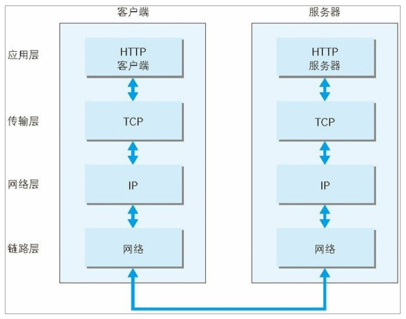
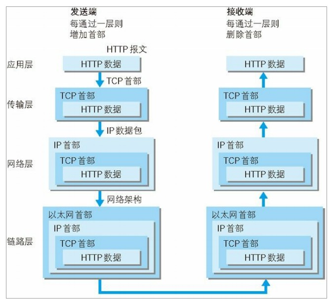
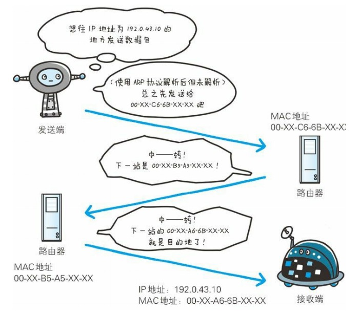
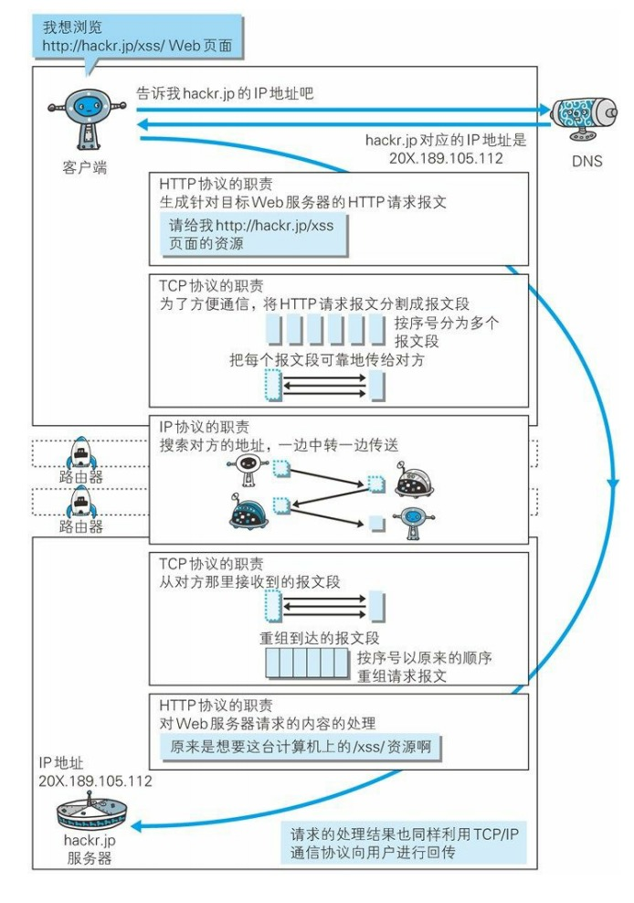

# 网络基础

# Index
- TCP/IP
  - 分层管理
  - 通信传输流
- 与 HTTP 密切相关协议
  - IP
  - TCP
  - DNS
  - 各种协议与 HTTP 协议的关系
- 术语
  - 协议族
  - 协议

# TCP/IP

TCP/IP 是互联网相关的各类协议族的统称；从电缆的规格到 IP 地址的选定方法、寻找用户的方法，再到双方建立通信的顺序，以及 Web 页面显示需要处理的步骤等等...

## 分层管理

在 TCP/IP 协议族[^1]中，分层是很重要的一个概念，其优势主要在于两点：
1. 如果只由一个协议族统筹，则任意更改就需要把部分整体替换掉，而分层后则需要变动指定的层级的部分内容；
2. 后续设计、拓展更加简便，层级之间各自的职责更加专注、明确；例如，应用层上的应用只需要考虑分派给自己的任务，而无需考虑数据传输等相关的问题。

TCP/IP 协议族按层次分别划分为4层：
- 应用层: 该层级决定了向用户提供应用服务时通信的活动，TCP/IP 协议族内预存了各类通用的应用服务，例如 FTP（File Transfer Protocol，文件传输协议），DNS（（Domain Name System，域名系统）、HTTP 协议等...
- 传输层: 提供处于网络连接中的两台计算机之间的数据传输，在传输层中，有两个性质不同的协议 TCP（Transmission Control Protocol，传输控制协议）和 UDP （（User Data Protocol，用户数据报协议）;
- 网络层: 网络层用来处理在网络上流动的数据包,数据包是网络传输的最小数据单位;该层规定了通过怎样的路径（所谓的传输路线）到达对方计算机，并把数据包传送给对方;与对方计算机之间通过多台计算机或网络设备进行传输时，网络层所起的作用就是在众多的选项内选择一条传输路线;
- 链路层:用来处理连接网络的硬件部分,包括控制操作系统、硬件的设备驱动、NIC（Network Interface Card，网络适配器，即网卡），及光纤等 物理可见部分（还包括连接器等一切传输媒介）;硬件上的范畴均在链路层的作用范围之内。

## 通信传输流

通过流程可知，利用 TCP/IP 协议族进行网络通信时，会通过层级顺序与对方进行通信，发送端由应用层往下走，而接收端则由链路层往上走。

流程说明（此处以 HTTP 举例）:

1. 首先作为发送端（客户端）的在应用层（HTTP 协议）发出想浏览某一 Web 页面的 HTTP 请求；
2. 传输层（TCP 协议[^2]）把从应用层收到的数据（HTTP 请求报文）进行分割，并在各个报文上搭上标记序号以及端口号后转发给网络层；
3. 网络层（IP 协议）增加作为通信目的地的 MAC 地址后转发给链路层，此时，一个完整的通信请求就准备完毕了；
4. 链路层传达至目标服务器；
5. 当目标服务器的链路层接收到数据后，按序往上层传递，一直到应用层，才算真正接收到由客户端发送过来的 HTTP 请求。

发送端在层之间传输数据时，数据每经过一层时会被打上一个该层所特有的首部信息；反之，接收端在层之间传递数据时，每经过一层时则会把对应的首部消去；这种把数据信息包装起来的做法被称为封装。

# 与 HTTP 密切相关协议

在 TCP/IP 协议族中，与 HTTP 协议相关的协议主要有三个，分别是 IP、TCP、DNS。

## IP 协议

按层次划分的话，IP（Internet Protocol，网际协议）协议位于网络层，需要注意的是：
1. 几乎所有的网络系统都需要用到 IP 协议，而在 TCP/IP 协议族中，IP 指的便是网际协议;
2. IP 协议与 IP 地址是两个概念。

**IP 协议的作用是把各种数据包传输给对象**；而要确保准确的传达至对方，则需要满足各类条件，其中两个重要的条件是 IP 地址以及 MAC 地址（Media Access Control Address）。

IP 地址指明了节点被分配到的地址， MAC 地址是指网卡所属的固定地址，IP 地址可以和 MAC 地址进行配对，其中， IP 地址可以变换，但 MAC 地址基本不会更改。

IP 间的通信依赖 MAC 地址，在网络中，通信双方存在于同一局域网的场景相对少见，通常需要经过多台计算机和网络设备中转才能连接到对方；而在进行中转时，会利用下一站中转设备的 MAC 地址来搜索下一个中转目标，此时，则会采用 ARP 协议（Address Resolution Protocol），该协议是一种用以解析地址的协议，根据通信方的 IP 地址就可以反查出对应的 MAC 地址。

在到达通信目标前的中转过程中，计算机和路由器等网络设备只能获取到很粗略的传输路线信息，这种机制被成为路由选择，其整个流程有点类似快递的运输流程，发件人只需要将快递送达至集散中心，就可以知道快递公司是否肯收发货物，而集散中心根据收货地址明确下站该送往那个区域的集散中心，接着那个区域的集散中心会自动判断能否送达至收件人手中。通过该比喻可得知，在互联网中，无论那台计算机、网络设备，它们都无法掌握整个流程中的全部细节。

## TCP/IP 协议

## DNS 服务

DNS（Domain Name System）服务是和 HTTP 协议一样位于应用层的协议，**它提供域名到 IP 地址之间的解析服务**；计算机既可以被赋予 IP 地址，也可以被赋予主机名和域名，例如 github.com。
通常而言，IP 的数字格式对于计算机更加友好，而对于用户则并不友好，而域名格式则相反，因此 DNS 服务应运而生，DNS 协议提供了通过域名查找 IP 地址或反向的通过 IP 地址查找域名的服务。

## 各种协议与 HTTP 协议的关系

# 术语

- [^1]: 特指由若干协议组成的协议群；
- [^2]: 由于设备之间的不同，故而通信则必须遵循某种相同的方法，所有的这一切方法、规则、约定被称为协议；